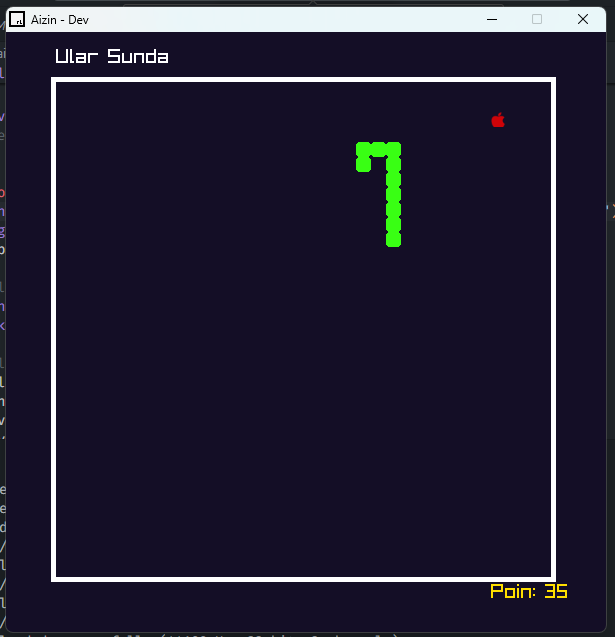

# Ular Sunda Game

Alkisah dipedalaman hutan amazon terdapat seekor ular sunda yang suka makan buah apel. Buah apel tersebut terletak di daerah air terjun ngawi dimana aliran nya sederas gejolak asmara. Konon legenda mengatakan apabila menemukan ular tersebut, maka kita wajib membeli aerox. 
Selamat mencoba game ini. masih dalam percobaam dengan versi 0.0.0.0.0.0.0.0.0.0.0.0.0.1.

# kalo mau main
Langsung saja klik file main.exe

# Gimana jalannya bang?
1. instal raylib melalui https://www.raylib.com/
2. Konfigurasinya pikir sendiri bang

# Cara kerja game?
Secara garis besar ini hanyalah konsep array statis untuk tubuh ular, saya menggunakan ukuran 600x600 pixel untuk ukuran layer game. Dimana pixel-pixel ini kemudian direpresentasikan dalam grid 15x15 pixel untuk satu elemen tubuh begitu juga dengan ukuran makanan. Array tubuh ular akan bertambah jika posisi grid indeks pertama sebagai kepala, sama dengan posisi grid makanan, maka arraynya bertambah. selebihnya penyesuaian sesuai keinginan developer...

